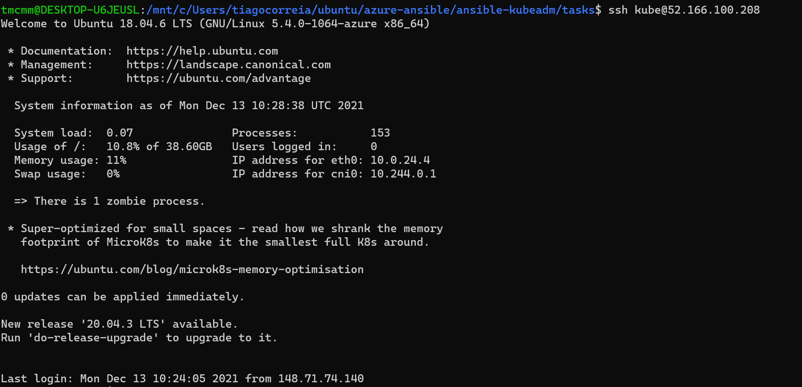
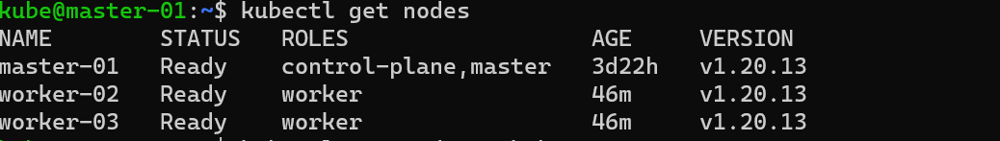
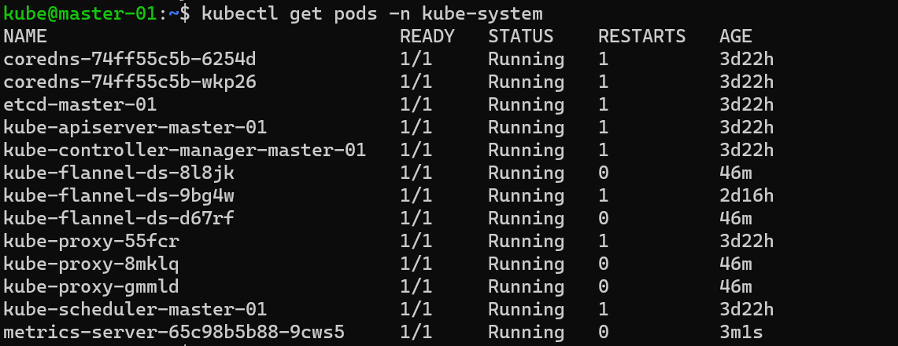

# Ansible Project

This project is for creating multiple environment labs using Ansible

## How to

Change the variables.yml and the hosts.ini file accordingly to the variables you want to use.

### Pre-Requisites

- Having Ansible Installed >=2.9
- python >= 2.6
- azure >= 0.7.1
- Azure modules and Azure community modules
- Create an SP (Service Principal) capable of creating the Azure Objects
- Create the file credentials inside /home/user/.azure/

Install Azure modules and community modules:
```
ansible-galaxy install azure.azure_preview_modules   
wget -nv -q https://raw.githubusercontent.com/ansible-collections/azure/dev/requirements-azure.txt
pip3 install -r requirements-azure.txt
ansible-galaxy collection install community.azure
```
__Create SSH-KEY Pair:__
```
ssh-keygen -o -t rsa -b 4096 -C "email@microsoft.com"
```
__list your subscription id :__
```
az account show --query id --output tsv
az account list -o table | grep 'your_subs_name' | awk '{print $3}'
```
__Creating SP:__
```
SUBS_ID='output from above'
az ad sp create-for-rbac --name svc-ansible-azure --role="Contributor" --scopes="/subscriptions/$SUBS_ID" --skip-assignment >> sp-credentials-ansible.yaml 2>&1
```
* AZURE_SUBSCRIPTION_ID ==> subscription_id <br>
* AZURE_CLIENT_ID ==> appId <br>
* AZURE_SECRET ==> password <br>
* AZURE_TENANT ==> tenant <br>

__Store the following under credentials file located in ~/.azure/credentials:__
```
[default]
subscription_id=10dfa491-xxxxx-xxxx-a4ee-9aeb49b8c00e
client_id=db93c95c-xxxx-4cb7-xxxx-773baa4cddef
secret=xxxxxxxxx.O_-e3vWPb-iKAeM
tenant=72f988bf-xxxx-41af-xxxx-2d7cd011db47
```

### Run the playbooks
__Change the hosts.ini file to match the public ip's of your machines:__
```
[masters]
insert_public_ip ansible_user=azureuser
[workers]
insert_public_ip ansible_user=azureuser
insert_public_ip ansible_user=azureuser

[all:children]
workers
masters

[all:vars]
ansible_python_interpreter=/usr/bin/python3
ansible_ssh_common_args='-o StrictHostKeyChecking=no'
[masters:vars]
kubernetes_role="master"
[workers:vars]
kubernetes_role="node"
```
```
cd tasks
ansible-playbook main.yml -i ../hosts.ini
```
__Log on the master node with the user kube that has your ssh public_key:__




### Delete the whole Resource-Group:
```
ansible-playbook delete_rg.yml --extra-vars "name=resource_group_name"
```
